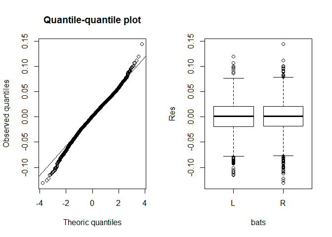
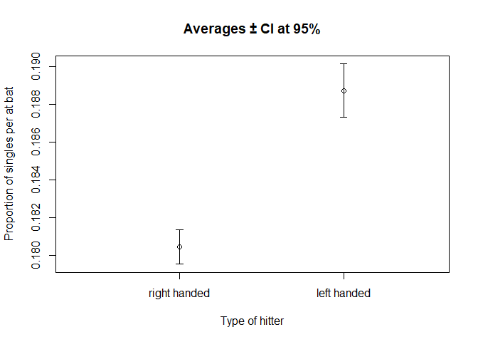

R Notebook
================

# Do right handed MLB players hit more singles on average than left handed players? An analysis

## Introduction

Baseball is an asymetric game. Since players must reach each base in a
counter clockwise order, it is assumed right handed hitters must have an
advantage in hitting singles since their natural range is the right
field and that field is the farthest away from the first base. This is
what we looked to find out in this analysis, whether right handed MLB
hitters hit more singles on average than left handed players. To get
there, we selected the data from the [Lahman Baseball
Databank](http://www.seanlahman.com/baseball-archive/statistics/), to
which we cleaned the data and summarized the average number of singles
per at bat for left handed and right handed players, and then did an
hypothesis testing to see if the difference is statistically
significative. The conclusions were that it was the opposite, that left
handed players hit more singles on average than right handed players,
with statistical significance. The causes of this difference are so far
unknown and will be open for further analysis.

## Analysis

### Data

The data collected consisted from the archives of the Lahman Baseball
Databank, which contains complete batting and pitching statistics from
1871 to 2017, plus fielding statistics, standings, team stats,
managerial records, post-season data, and more, from every player and
team from the listed time frame. More specifically, two data subsets
were used:

1.  The *Batting* subset, which gave us the batting statistics per
    *playerID*, per season, since 1871.
2.  The *People* subset, which gave us the players infos from each
    *playerID*, including the needed batting position.

### Methods

The methods consisted of the initial importing and cleaning which was
divided in these steps:

1.  Importing our needed libraries: dplyr and readr

<!-- end list -->

``` r
# Importing the libraries
library(dplyr)
library(readr)
```

2.  Importing our two subsets: Batting.csv and People.csv

<!-- end list -->

``` r
# Importing the two subsets
Batting <- read_csv("C:/Users/Guillaume/Downloads/baseballdatabank-master_2018-03-28/baseballdatabank-master/core/Batting.csv")
People <- read_csv("C:/Users/Guillaume/Downloads/baseballdatabank-master_2018-03-28/baseballdatabank-master/core/People.csv")
```

3.  Joining our two subsets: Frap

<!-- end list -->

``` r
# Joining the two subsets
Frap <- inner_join(Batting, People, by = "playerID")
```

4.  Arrange our Frap subset to get our needed data frame Frappeurs,
    which will include our playersID, his batting position and his
    single’s average over his MLB career.

<!-- end list -->

``` r
# Creating the Frappeurs dataframe
Frappeurs <- Frap %>%
  select(playerID, yearID, AB, H, "2B", "3B", HR, bats) %>%
  mutate(simples = H - `2B` - `3B` - HR) %>%
  select(playerID, yearID, bats, AB, simples) %>%
  filter(bats %in% c("R", "L") & AB >= 100) %>%
  mutate(propsimple = simples/AB) %>%
  select(playerID, yearID, bats, propsimple) %>%
  group_by(playerID, bats) %>%
  summarize(avgpropsimple = mean(propsimple))
```

Then, we verified the suppositions in order to make sure we could
operate an hypothesis testing. These suppositions were the:

1.  Normality (through an Anderson-Darling test)
2.  Homoscedasticity (through a boxplot)

These steps are listed in this code:

``` r
# Verification of the suppositions
# Creation of the residual subsets for the Anderson-Darling test
droitier <- Frappeurs[Frappeurs$bats == "R", ]
droitier.res <- droitier$avgpropsimple - mean(droitier$avgpropsimple)
gaucher <- Frappeurs[Frappeurs$bats == "L", ]
gaucher.res <- gaucher$avgpropsimple - mean(gaucher$avgpropsimple)
Frappeurs$Res <- c(droitier.res, gaucher.res)

# Verification of normality through an Anderson-Darling test
library("nortest")
ad.test(Frappeurs$Res)
## 
##  Anderson-Darling normality test
## 
## data:  Frappeurs$Res
## A = 6.0941, p-value = 5.63e-15
```

``` r
# Graphic display of the test
options(jupyter.plot_mimetypes = 'image/png')
par(mfrow = c(1, 2))
qqnorm(Frappeurs$Res, ylab = "Observed quantiles",
       xlab = "Theoric quantiles",
       main = "Quantile-quantile plot")
qqline(Frappeurs$Res)
text(x = -2, y = 14.5, labels = "a", cex = 1.2)

# Verification of homoscedasticity through a boxplot
boxplot(Res ~ bats, data = Frappeurs)
text(x = 0.5, y = 14.5, labels = "b", cex = 1.2)
```

<!-- -->

The subsets are normalitated and homoscedasticitated and thus we could
conduct the statistical student test to verify the starting premise.

``` r
# Conducting Student Test
t.out <- t.test(avgpropsimple ~ bats, data = Frappeurs, var.equal = TRUE,
                alternative = "less")
t.out
## 
##  Two Sample t-test
## 
## data:  avgpropsimple by bats
## t = 9.9535, df = 6046, p-value = 1
## alternative hypothesis: true difference in means is less than 0
## 95 percent confidence interval:
##         -Inf 0.009643464
## sample estimates:
## mean in group L mean in group R 
##       0.1887338       0.1804581
```

### Interpretation

The results of the Student Test shows that right handed MLB hitters *do
not* hit more singles on average, and that the differences are
statistically significant.

### Results

The results illustrate that not only right handed MLB hitters do not hit
more singles on average, but they actually hit less than left handed
hitters, with the difference being statistically significant. Here are
plotted the results, with 95% confidence
intervals:

<!-- -->

## Conclusion

In conclusion, after analysing 6048 MLB hitters from 1871 to 2017, we
found that right handed hitters do not hit more singles on average than
left handed hitters. Rather, the opposite holds, that left handed
hitters hit more singles on average than right handed ones. Results were
statistically significant.

## Appendix

Lahman Baseball Databank:
<http://www.seanlahman.com/baseball-archive/statistics/>  
Original R Script:
<https://github.com/Guillaume2509/MLBSingleAvg/blob/master/MLBSingleAvg.R>

Guillaume Giroux, 2019
